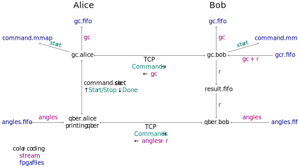

# Introduction

Alice sends states to Bob at a certain rate. She counts the number of states sent from the start. We refer to this counter as the global counter (gc; same name as this program). On the fpga level, every state is labelled with a gc, both on Alice and on Bob. When Bob detects a qubit, i.e. his detector produces a click, he labels the time of the detection with yet another gc.

The states sent are represented by an angle. Alice and Bob store these angles on the fpga level until the gcs are sorted out. Then they filter the angles and output the detected ones into their angles fifo.


## The purpose of this program 

There are two programs, gc_alice and gc_bob. Their purpose is to write the global counters to the fpga.

The fpga of Bob writes the gc value of the detection and the result bit of the detection into a fifo. Bob then has to seperate these two things and send the result bit towards the application and the gc value back to his fpga. He also has to send the gc value to Alice, who then has to put it to her fpga. See below figure with an application qber. 




## Application-side workflow

The application controls the progam gc by connecting to the gc of Alice through a Unix socket. 

There are only two commands

- Start
- Stop

They are acknowledged by a Done response

A typical workflow is

- open a socket to Alice's gc
- send Start, read Done
- run your application: read angles and result
- send Stop, read Done
- close the socket to Alice's gc


# Installation

build and copy the executables into `~/bin`. (The controller is a simple program to manually send Start/Stop.)

```.bash
cargo build --release
cp target/release/alice ~/bin/gc_alice
cp target/release/bob ~/bin/gc_bob
cp target/release/controller ~/bin/gc_controller
```


# Running hw_sim + gc + qber

We assume that `simulator`, `gc_alice`, `gc_bob`, `qber_alice`, `qber_bob` and `gen_config` are executable from everywhere. See their respective repos if that is not yet the case.


Generate the config files

```.bash
gen_config -c meta_config_for_sim.json -s sim_config.json
```

Execute the following bash script. It will run `sim+gc` in background without any output and only show the output of `qber_alice`.
```.bash
simulator -c alice/sim.json > /dev/null &
simulator -c bob/sim.json > /dev/null &
sleep 0.1

gc_alice -c alice/gc.json > /dev/null &
gc_bob -c bob/gc.json > /dev/null &
sleep 0.1

qber_bob -c bob/qber.json > /dev/null &
sleep 0.1
qber_alice -c alice/qber.json 12800
```

`qber_alice` should print the correlation matrix and a qber corresponding to `sim_config.json`.

Don't forget to 

```.bash
pkill qber
pkill gc
pkill simulator
```


In case of problems, run in seperate terminals and verify the output.


